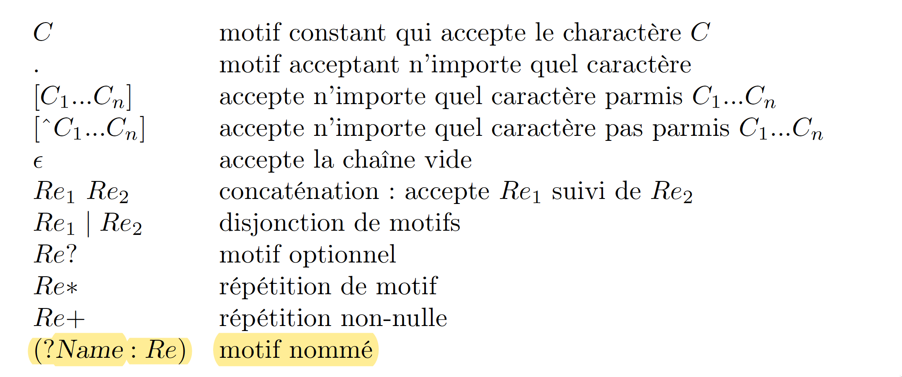

# IFT2035-TP2
Prolog Regex expression match with NFA  

Implementation of a regular expression search algorithm that uses an NFA internally. This is done in two parts:
1. With the implementation of ```nfa_match``` , which executes a given NFA on a given channel.
2. The implementation of ```re_comp``` , which takes a regular expression and translates (compiles) it into an NFA.

## The supported grammar for REGEX is given below:

