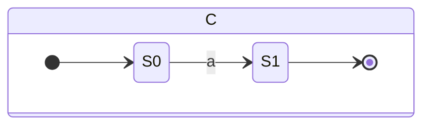

# un commencement difficile

Nous avons commmencé notre travaille en essayant de comprendre comment marche prolog et comment fonctionne les NFA. 

Par la suite, nous avons commencé a implémenté la fonction nfa_search. Dans le fond, on cherche juste a faire un patern match sur 3 cas de step importants:
    - Si le step est un "success" comme cas de base
    - Si le step est de la forme step(...) donc on traite un de deux cas:
        - Si nous avons un passage a un prochain état qui est conditionel a l'entrée, donc nous avons besoins de tester le branchement avec le prochain charactère. Si celui ci est bon, nous acceptons et renvoyons le next step a executé. Sinon, on renvoi et on essaye la prochaine condition.
        - Si nous avons un passage a un prochain état inconditionel, nous "mangeons" un charactères et nous retournons le prochain état
    - Si le step est epsilon(...), nous traitons les mêmes cas que pour step mais nous ne consomont pas de charactères. 

Or, en retournais l'état, nous ne retournons pas son contenue donc nous avons besoins d'aller chercher dans notre NFA le contenu de l'état pour l'assigner a notre prochain "step". Celà est pris en charge par une fonction ```nfa_fetch_step_content(+NFA, +State, -Res)```. 

Probleme des listes vides


# Problèmes 

## NFA de not_in
- Au début nous avons concu notre NFA pour énuméré toutes les steps de charactère qui étais not-in vers success et dans ce cas on ne ferais que retourner ce qui n'est pas dans notre liste de not-in. Avec cette approche, par example, si j'avais [^abc], je retournerais touts les steps de d à Z et je les pointerais vers success. Or, nous avons demandé a Stefan c'est quoi le range des charactères ASQII a suporté et je pense qu'il nous a vue venir... Il nous a dis que c'étais illimité. Nous avons alors repensé et nous avons trouvé le complement de cette approche. Celà a mener a la création d'un "reject state" où, si l'on donne un charactère dans notre liste not-in, on l'envoi vers un état et a la fin, si tout est bon on envoi vers success. 
Cette méthode étais bonne jusqu'à ce qu'on utilise la fonction ```re_search```. Ici, nous nous somme rendu compte que c'étais pas un NFA valide car nous ne pouvons pas juste retourné un état qui ne vas pas vers success. Finalement, nous avons rajouté un état epsilon après l'état rejettant pour quand même le remmener vers l'état final (en rouge sur le diagramme).
<Insert Diagram>

## NFA avec disjonction ternaire (ou plus)
- Nous avons eu un problème par rapport a l'implémentation du NFA de disjonction du fais que celui-ci n'étais pas une liste et que selon notre 1ere implémentation tout l'état initial devais toujours se rendre vers une option de la disjonction (<voir figure disjonction>). Avec cette méthode on étais pas capable de transitioner tout les états finaux vers un seul état final. 
La solution a été de crée un genre d'arbre binaire et d'avoir uniquement deux output ou deux input pour chaques noeud. (<Voir nouveau NFA>). 

## La liste de 1 elem a la fin

## Par rapport au liste / string dans in or notin


# Les tests

Nous avons très vite réalisé que de tester le tout a la main serais vraiment trop compliqué. Nous avons donc trouvé que c'étais assez facile de tester notre code de facon automatisé en utilisant le framework de test de SWIPL. En faite, tout nos cas de tests sont des tests d'intégration du fait que l'on test le ouput de la fonction search/3 avec le output de notre fonction re_search/3. Nous utilisons la fonction auxiliaire suivante pour faire celà: 

``` prolog
    find_search_result(NFA, Str, A, B) :-
        findall(S, search(NFA, Str, S), A),
        findall(X, re_search(NFA, Str, X), B).
```

ainsi, nous n'avons qu'a comparé le output de A avec celui de B. 
Pour voir les tests utilisé [tp2_test.plt (via github gist)](https://gist.github.com/jeankhoury0/a6e835df89e4d1432bd6e588435d5aae)


# Motif nommée
- Nous avons modifié un petit peu le code d'epsilon pour que celui ci prennene en charge les marks. C'étais juste de rajouté la variable Marks au pattern Matching et le programme continue. 


